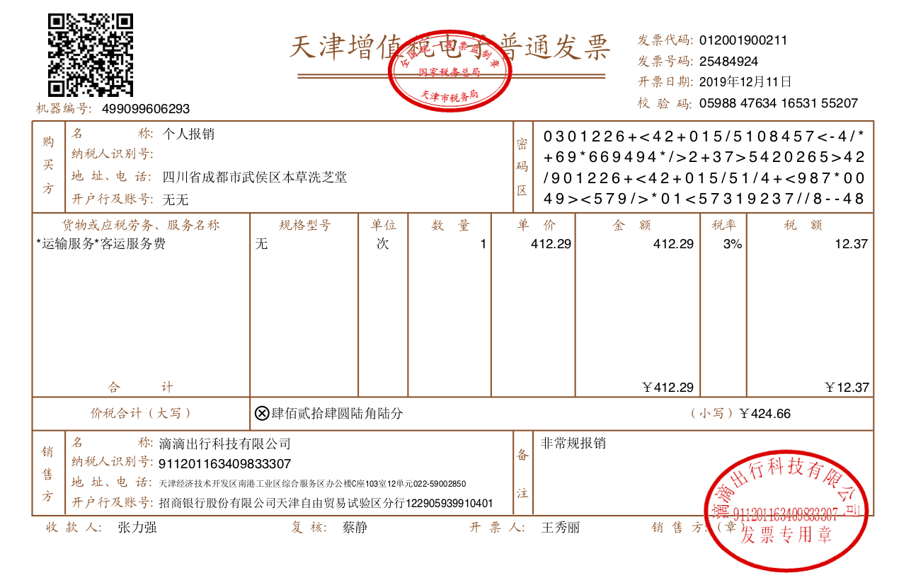

# pytorch-table 运用 unet 实现对文档表格的自动检测，表格重建

1. 此项目为[table-ocr](https://github.com/chineseocr/table-ocr)的 pytorch 版本，环境配置简单
2. 模型文件兼容 darknet 的.weights 文件和 pytorch 的.pth 权重文件

## 下载 text.weights 模型文件

1. 模型文件(table-ocr 作者提供): [下载](http://59.110.234.163:9990/static/models/table-ocr/table.weights)
2. 拷贝 table.weights 文件到 weights 目录
3. 确认一下 config.py 配置是否正确

## 测试

```Bash
python3 predict_table.py test/dd.jpg
```

## 识别结果展示



### 单元格输出


### 横线竖线检测


